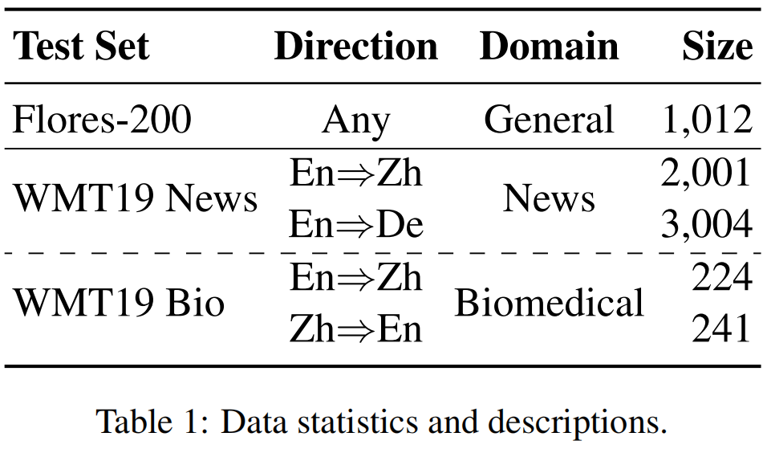
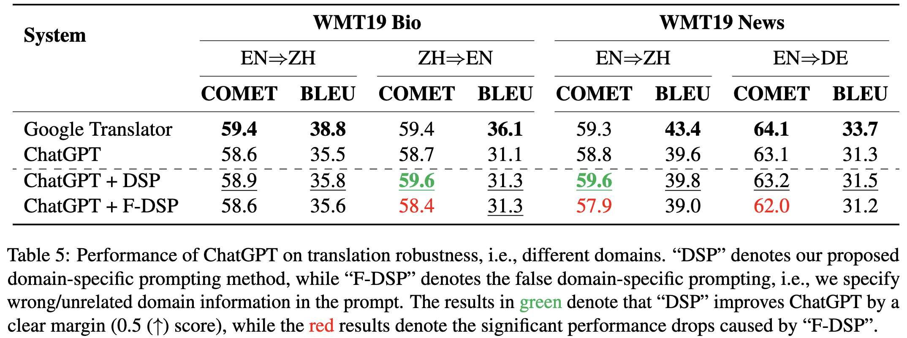
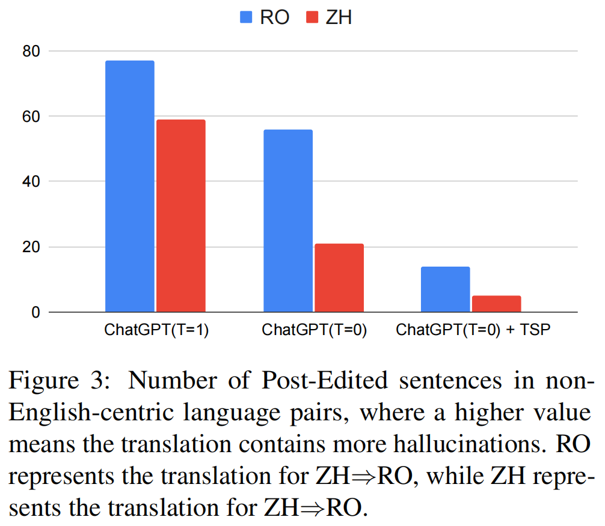
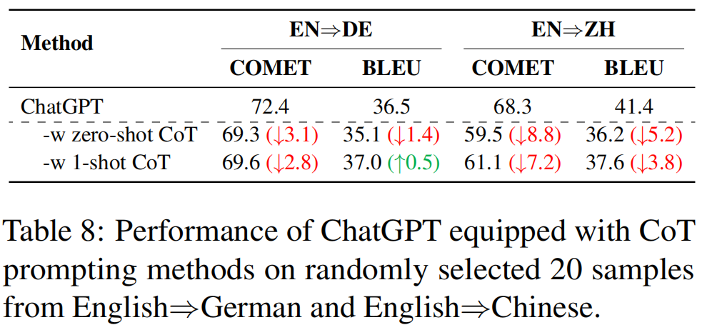

# Towards Making the Most of ChatGPT for Machine Translation

<b>Towards Making the Most of ChatGPT for Machine Translation</b>. ([Full report](https://arxiv.org/abs/2303.13780), Findings of EMNLP 2023 [accpeted version](https://aclanthology.org/2023.findings-emnlp.373))

This repository releases the test sets evaluated by [ChatGPT](https://chat.openai.com/chat) API (gpt-3.5-turbo-0301),  for the replication of the study.

## Abstract

<div align="center">
    
</div>

## Data and Evaluations

We evaluate the performance of the models on the [Flores-200](https://github.com/facebookresearch/flores/tree/main/flores200) and [WMT19 Bio](https://www.statmt.org/wmt19/biomedical-translation-task.html) and  [News](https://www.statmt.org/wmt19/translation-task.html) test sets. The task statistics are shown as follows:


<div align="center">
    
</div>

## Results and Findings

1. ChatGPT's performance largely depends on the temperatures, especially in difficult languages. Generally, setting a lower temperature can result in higher performance.

    > The relationship between temperature and ChatGPT's performance:
<div align="center">
    
</div>

2. Emphasizing the task information in prompts can further improve ChatGPT's performance, especially in complex tasks.
    > Influence of Task-Specific Prompts (TPS) on ChatGPT:
<div align="center">
    
</div>

3. Introducing the correct domain information consistently improves ChatGPT's performance while wrong domain information leads to significant degradation in performance.

    > Influence of Domain-Specific Prompts (DPS) on ChatGPT:
<div align="center">
    
</div>

4. When tackling non-English-centric tasks (both the input and expected output are non-English), ChatGPT may generate hallucinations, which should be paid more attention to by the MT/NLP community.
 
    > The number of sentences that need to be post-preprocessed in different settings:
<div align="center">
    
</div>

5.  CoT leads to word-by-word translation behavior, thus bringing significant translation degradation.

    > The effect of CoT on ChatGPT:
<div align="center">
    
</div>

Please refer to our full [report](https://arxiv.org/abs/2303.13780) for more details.

## Media Coverage
- Slator: [“You Are a Machine Translation System” — How to Improve ChatGPT’s Translations](https://slator.com/machine-translation-system-how-to-improve-chatgpts-translations/)

## Citation
If you find this work helpful, please consider citing as follows:  
```ruby
@inproceedings{Peng2023ChatGPT4MT,
  title={Towards Making the Most of ChatGPT for Machine Translation},
  author={Peng, Keqin and Ding, Liang and Zhong, Qihuang and Shen, Li and Liu, Xuebo and Zhang, Min and Ouyang, Yuanxin and Tao, Dacheng},
  booktitle={Findings of EMNLP 2023},
  url={https://aclanthology.org/2023.findings-emnlp.373},
  year={2023}
}
```
